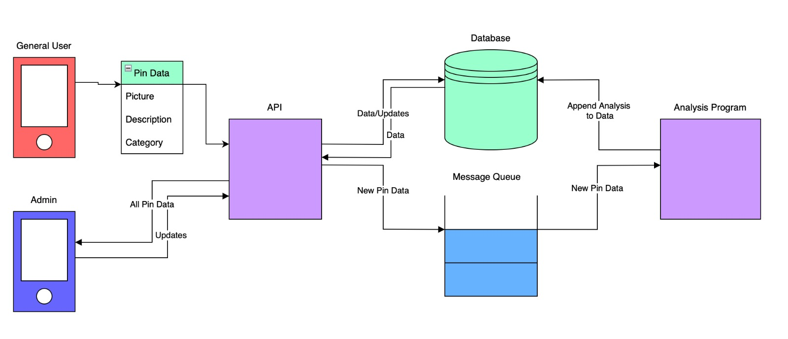
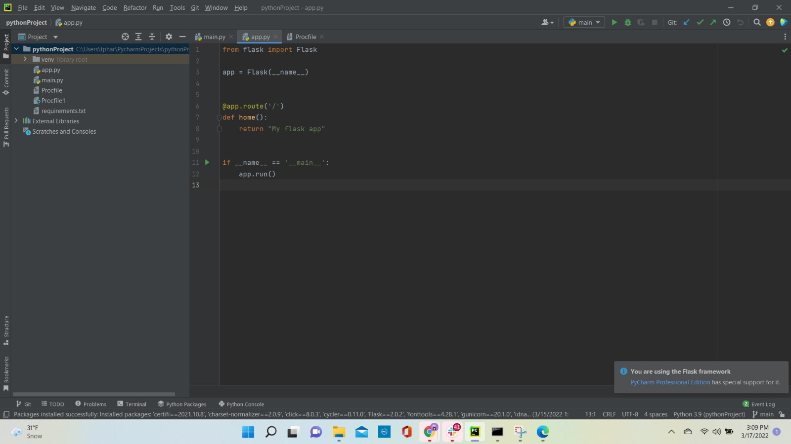
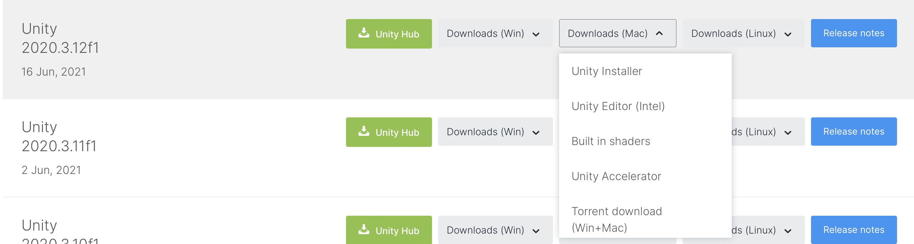
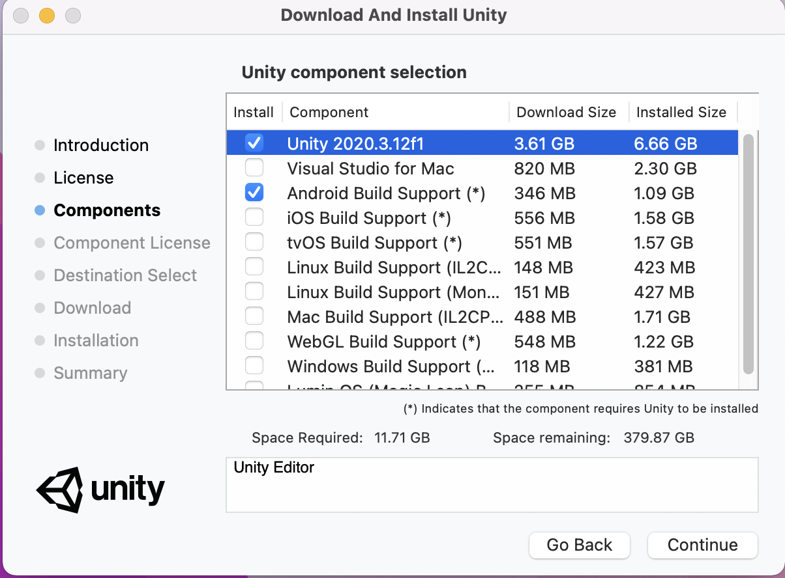
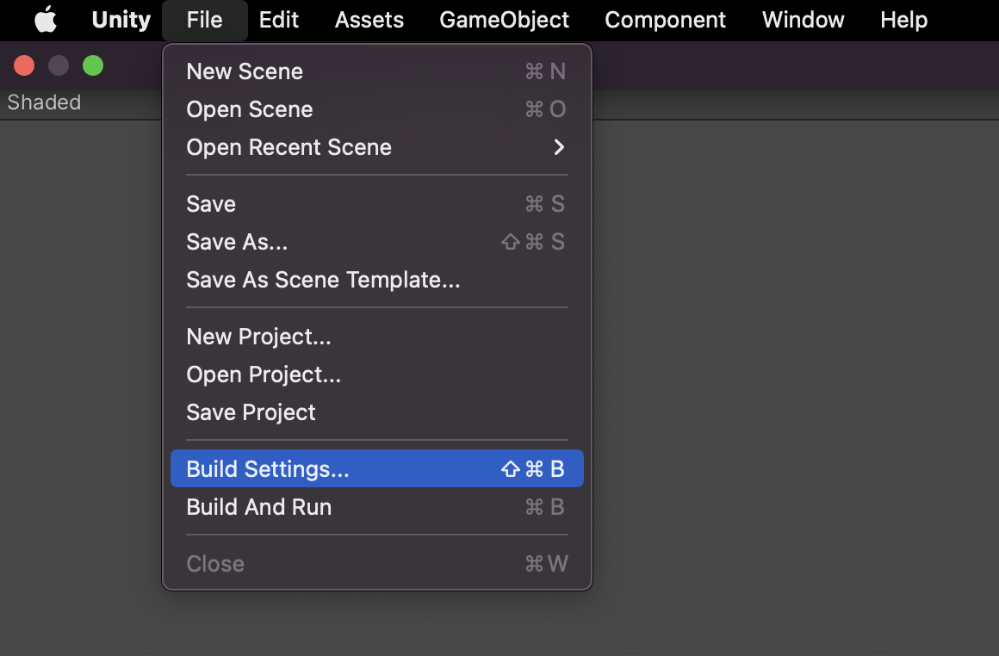
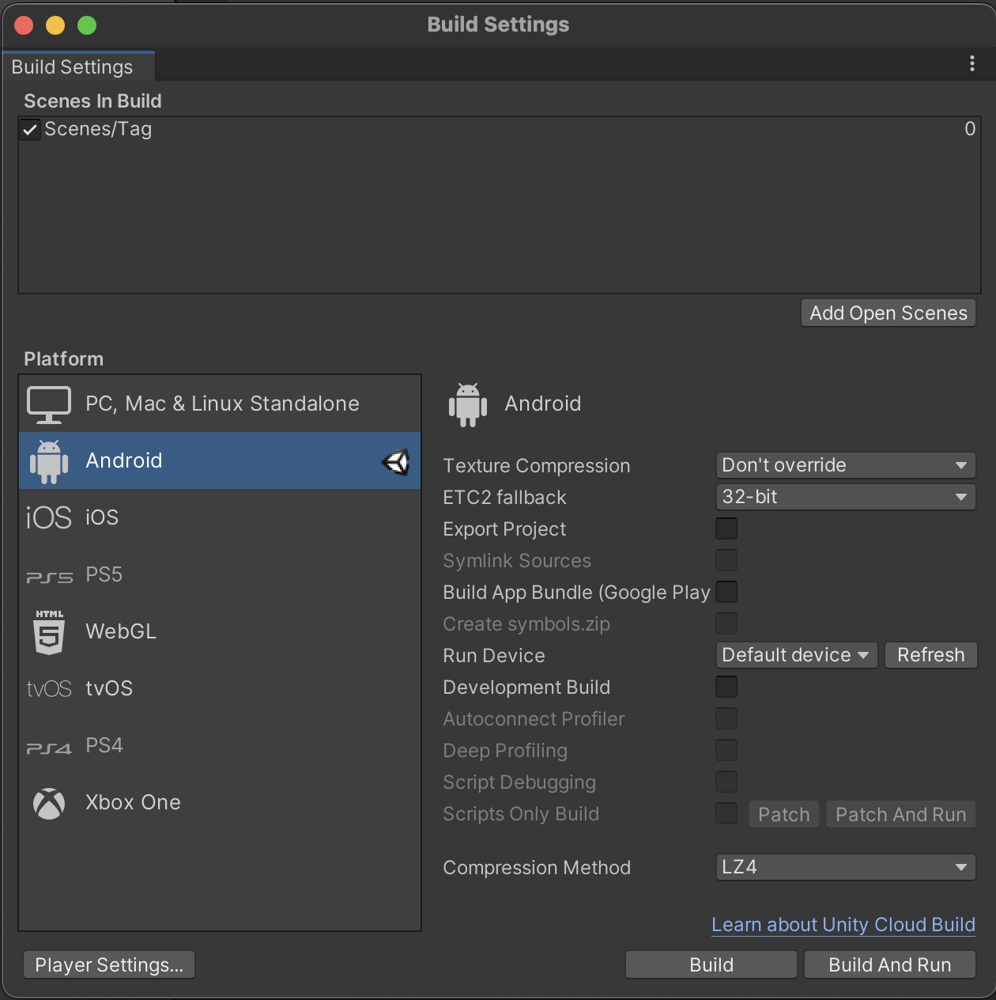

# Project name: Augmented Sapiens 
## Project Description: 
An Augmented Reality maintenance system where users can raise service requests by tagging objects (using virtual markers) and clicking it's picture for admin team to analyze and fix.

### Developers: 
Rajshekar G S - rajshekar.gudasubhash@colorado.edu

Saumya Bansal - saba6167@colorado.edu

Harini Thorali - hath3708@colorado.edu

Aidan Bolton - aibo2813@colorado.edu

### Pivotal Tracker URL: 
https://www.pivotaltracker.com/n/projects/2558990 

### Heroku: 
URL: https://dashboard.heroku.com/pipelines/2f38c4f0-ec70-4766-b7f9-a8f9b510dd48

Staging: https://augmentedsapiens-staging.herokuapp.com/ 

Prod: https://augmentedsapiens-prod.herokuapp.com/

## Getting Started:
We are using Unity for developing the frontend and a flask based application for developing the backend. RabbitMQ will be used as the messaging service connecting various api's while PostgreSQL database will be used to store the maintenance requests.

## UML Diagram:

## Installation steps:

### Steps for deploying the flask app onto Heroku:
- If you don’t have a Heroku account, sign up for a new one.
- Download and Install Heroku CLI.
- On the IDE of your choice, have your flask app ready.  
For example:  

- Open the terminal at this application location and run the following commands:  
  pip3 install gunicorn  
  pip3 freeze > requirements.txt  
  touch Procfile # creates a Procfile  
- Inside the procfile, add the following:  
  Web: gunicorn app:app
- Now, go to github and create a new repository for your application, if it is not existing already.
- Push the code to the github repo.
- Next go to terminal and type: heroku login
- This will take you to the heroku login page. Click on login and return back to the terminal.
- Create heroku app on terminal command: heroku create flask-app-deploy
- Once this is done run the following command to deploy our code to heroku: git push heroku <branch_name>
- Once done, type heroku open. It will open the deployed app on the browser.
- We can also deploy an application through the Heroku page - New app → Under staging / production → New app → Fill in app name and click on create app → Go inside the app → Under Deploy, Deployment method → Connect the app to Github repository → Under Automatic / Manual Deploy, choose the branch you want to deploy and click on deploy

### Steps for deploying the Mobile App:

#### Download Unity

1. This project uses Unity 2020.3.12f1, make sure to use this specific version to recreate the mobile app.
2. Download Unity 2020.3.12f1 from the [Unity archive](https://unity3d.com/get-unity/download/archive). Select 'Unity Installer' from the dropdown menu for your chosen operating system. Do NOT select Unity Hub.    
    
3. Select the following components during installation. This project is built for Android and hence only requires "Android Build Support". However, if you are on a macOS system you can also select "iOS Build Support" to build for iOS devices.   
   

#### Open Project and Build

1. After installation, open Unity and click on "Open Project". Select the folder where you cloned this repo.
2. Make sure Unity's build platform is set to Android by going to "File->Build Settings". The Android option should have the Unity logo next to it. If not, select "Android" and then click on "Switch Platform" in the bottom-right corner.   
      
3. Click on "Build" in the bottom-right corner and Unity will generate a .apk file.   
      
4. Install .apk on an Android device. Enjoy!

			
